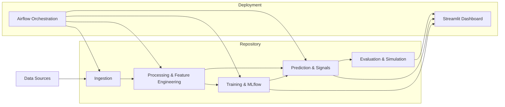

# Energy Market Analytics

A modular energy market forecasting and decision-support repository focused on PTF-based price forecasting, ingestion pipelines, model training, evaluation, and deployable monitoring.

## What it is

- Ingests market, generation, consumption, SMF and weather data
- Builds and trains PTF forecasting models, including conventional and LightGBM variants
- Produces predictions, evaluation metrics, trading signals, and imbalance cost simulation
- Orchestrates workflows with Docker, Airflow, and MLflow
- Provides an interactive Streamlit dashboard for evaluation and signal inspection

## Key components

- `src/ingestion/` - data fetchers for consumption, EPİAŞ PTF, generation, SMF, and weather
- `src/processing/` - data cleaning and feature processing modules
- `src/forecasting/ptf/` - model training scripts for the PTF forecasting stack
- `src/predict/` - prediction utilities for auxiliary series and model runtime inference
- `src/decision/` - signal generation and imbalance cost simulation
- `src/evalution/` - forecast evaluation logic and metrics
- `src/app/` - Streamlit application for model monitoring and result analysis
- `airflow/dags/` - production DAGs for inference and retraining pipelines
- `notebooks/` - exploratory data analysis, feature engineering, and modeling experiments

## Architecture



## Requirements

- Python 3.x
- `pip install -r requirements.txt`
- Docker and Docker Compose for the Airflow/MLflow stack

## Quick start

1. Copy environment variables:

```bash
cp .env.example .env
```

2. Update `.env` with your local credentials and ports.

3. Launch the stack:

```bash
docker compose up -d
```

4. Open services:

- Airflow: `http://localhost:${AIRFLOW_PORT}`
- MLflow: `http://localhost:${MLFLOW_PORT}`

5. Run the dashboard locally:

```bash
streamlit run src/app/streamlit_app.py
```

## Local development

- Install dependencies:

```bash
python -m pip install -r requirements.txt
```

- Run individual scripts or modules from `src/` for data ingestion, preprocessing, training, prediction, and evaluation.
- Explore notebooks in `notebooks/` for data collection, EDA, feature engineering, and modeling.

## Workflow overview

1. Ingest raw market, generation, consumption, SMF and weather data
2. Process raw inputs into training and inference features
3. Train PTF forecasting models and register experiments in MLflow
4. Produce forecasts and decision signals
5. Evaluate results and simulate imbalance costs
6. Orchestrate recurring pipelines with Airflow

## Notes

- `docker-compose.yml` defines PostgreSQL services for the warehouse and Airflow metadata, plus MLflow and Airflow containers.
- `nginx/nginx.conf` can be used as a reverse proxy in deployment scenarios.
- The repository uses `src/` as the main application package root.

## License

Use and adapt the code under your preferred project license.
