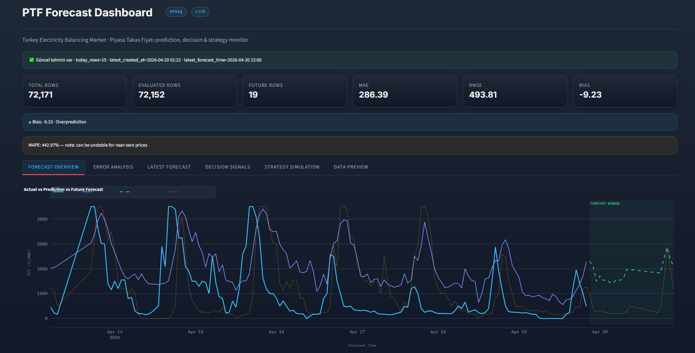

# Energy Market Analytics

A modular energy market forecasting and decision-support system focused on Turkish electricity market PTF price prediction. Ingests EPİAŞ, generation, consumption, SMF, and weather data to produce hourly PTF forecasts, imbalance cost simulations, and trading decision signals.

## What it does

- Fetches and processes market, generation, consumption, SMF, and weather data from EPİAŞ and external APIs
- Trains auxiliary forecasting models (generation, consumption, SMF) and a main LightGBM PTF price model
- Produces hourly PTF predictions, trading decision signals, and imbalance cost simulations
- Orchestrates recurring and on-demand workflows with Airflow
- Tracks experiments and model artifacts with MLflow
- Provides an interactive Streamlit dashboard for monitoring predictions, signals, and evaluation metrics

## Dashboard



> Turkey Electricity Balancing Market · PTF prediction, decision & strategy monitor. Shows actual vs predicted PTF prices (TL/MWh), forecast window, evaluation metrics (MAE, RMSE, Bias), decision signals, and strategy simulation tabs.

## Architecture

```
Data Sources
    │
    ▼
Ingestion (src/ingestion/)
    │
    ▼
Processing & Feature Engineering (src/processing/ · src/features/)
    │
    ├──────────────────────────┐
    ▼                          ▼
Training                   Prediction
(src/forecasting/ptf/)     (src/predict/ · src/decision/)
(MLflow)                       │
                               ▼
                    Evaluation & Simulation
                       (src/evalution/)
                               │
                               ▼
                    Streamlit Dashboard
                         (src/app/)

Airflow orchestrates all stages across three DAGs
```

## Pipelines

### `retrain_ptf_pipeline`

**Schedule:** manual (`schedule=None`)

Fetches all source data, trains auxiliary models (generation, consumption, SMF) and the main LightGBM PTF model from scratch, and registers artifacts in MLflow.

```
fetch + process raw data
    │
    ├── build_generation_features (train) ──► train_generation
    ├── build_consumption_features (train) ──► train_consumption
    └── build_smf_features (train) ──► train_smf
                                            │
                               process_ptf + process_weather
                                            │
                                   build_features (ptf, train)
                                            │
                                        train_lgbm ──► MLflow
```

### `inference_ptf_latest_pipeline`

**Schedule:** `0 * * * *` (every hour)

Fetches live data, generates auxiliary predictions using pre-trained artifacts, builds PTF features, runs LightGBM inference, and produces decision signals and imbalance cost simulation for the latest day.

```
fetch + process raw data
    │
    ├── build_generation_features (inference_latest) ──► predict_generation_latest
    ├── build_consumption_features (inference_latest) ──► predict_consumption_latest
    └── build_smf_features (inference_latest) ──► predict_smf_latest
                                                        │
                                    process_market + process_weather
                                                        │
                                      build_features (ptf, inference_latest)
                                                        │
                                              predict_ptf_latest
                                                        │
                                      generate_ptf_decision_signals
                                                        │
                                        simulate_ptf_strategy
                                                        │
                                          evaluate_ptf_forecast
```

### `inference_ptf_backfill_pipeline`

**Schedule:** manual (`schedule=None`)

Same structure as the latest pipeline but supports three backfill modes passed via Airflow `dag_run.conf`:

| Mode | Behavior |
|---|---|
| `backfill_auto` | Fills only missing periods automatically |
| `backfill_full` | Reprocesses the entire history |
| `backfill_range` | Processes a specific range using `start_date` and `end_date` |

> For `backfill_range`, both `start_date` and `end_date` are required — the pipeline exits with an error if either is missing.

## Repository structure

```
src/
  ingestion/        fetch_epias_ptf.py  fetch_weather.py  fetch_generation.py
                    fetch_consumption.py  fetch_smf.py
  processing/       process_ptf.py  process_weather.py  process_generation.py
                    process_consumption.py  process_smf.py  process_market.py
  features/         build_ptf_features.py
                      --pipeline  ptf | generation | consumption | smf
                      --mode      train | inference_latest | inference_backfill
  forecasting/ptf/  train_lgbm.py  train_gen.py  train_cons.py  train_smf.py
  predict/          predict_lgbm.py  predict_auxiliary_series.py
  decision/         generate_signals.py  simulate_imbalance_cost.py
  evalution/        evaluate_ptf_forecast.py
  app/              streamlit_app.py
airflow/dags/
  retrain_ptf_pipeline.py
  inference_ptf_latest_pipeline.py
  inference_ptf_backfill_pipeline.py
notebooks/          EDA · feature engineering · modelling experiments
data/
  raw/              EPİAŞ, weather, generation, consumption, SMF raw feeds
  processed/        market, generation, weather processed files
  features/         model input feature files
  predictions/ptf/  ptf_predictions_history.parquet
  decision/ptf/     ptf_decision_signals.parquet
                    ptf_strategy_simulation.parquet
                    ptf_decision_summary.json
                    ptf_strategy_simulation_summary.json
```

## Getting started

### Requirements

- Python 3.10+
- Docker & Docker Compose

### Local setup

```bash
# Install dependencies
python -m pip install -r requirements.txt

# Configure environment
cp .env.example .env
# Edit .env with your credentials, ports, and API keys
```

### Docker stack

```bash
docker compose up -d
```

Services after startup:

- Airflow: `http://localhost:${AIRFLOW_PORT}`
- MLflow: `http://localhost:${MLFLOW_PORT}`

### Dashboard

```bash
streamlit run src/app/streamlit_app.py
```

## Workflow

1. Fetch raw data — EPİAŞ PTF, weather, generation, consumption, SMF
2. Process raw inputs and build the market feature file
3. Build auxiliary features and generate auxiliary forecasts (generation, consumption, SMF)
4. Build PTF features, filling missing external variables with auxiliary predictions
5. Run LightGBM PTF inference
6. Generate trading decision signals via `generate_signals.py`
7. Run imbalance cost simulation via `simulate_imbalance_cost.py`
8. Evaluate forecasts and monitor results in the Streamlit dashboard

## Simulation parameters

`simulate_imbalance_cost.py` applies the following strategy multipliers:

| Position | Multiplier |
|---|---|
| high | 1.20 |
| risky-high | 1.05 |
| normal | 1.00 |
| risky-low | 0.90 |
| low | 0.80 |

Fixed defaults: `--base-generation 100`, `--use-pred-as-ptf-fallback`, `--smf-from-ptf-multiplier 1.00`.

## Running a backfill

Trigger `inference_ptf_backfill_pipeline` from the Airflow UI with a JSON config body:

```json
{ "mode": "backfill_auto" }
```

```json
{
  "mode": "backfill_range",
  "start_date": "2025-01-01",
  "end_date": "2025-03-31"
}
```

```json
{ "mode": "backfill_full" }
```

## Design notes

**Auxiliary models are decoupled from the PTF model.** Generation, consumption, and SMF models are trained separately. During inference, their predictions are computed first and injected as external features into the PTF feature build step. This avoids leakage and keeps the feature pipeline consistent between training and inference.

**Inference pipelines never retrain.** They load the latest artifact registered in MLflow by `retrain_ptf_pipeline`. Retraining is triggered manually and is fully decoupled from inference.

**Both inference pipelines share the same downstream stack.** Decision signal generation, simulation, and evaluation are identical — only the mode flag differs.

## Infrastructure notes

- `docker-compose.yml` defines PostgreSQL services for the data warehouse and Airflow metadata, plus MLflow and Airflow containers.
- `nginx/nginx.conf` provides a reverse proxy configuration for deployment.
- The `src/evalution/` directory name matches the actual path used throughout the codebase.
- All pipeline owners are set to `berke` in `default_args`.

## License

Use and adapt under your preferred project license.
